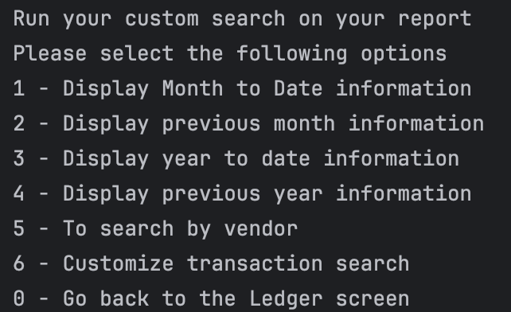

# Accounting Ledger Application

## Table of contents
- [Project Description](#project-description)
- [Features](#features-includes)
- [Home Screen](#home-screen)
- [Ledger Screen](#ledger-screen)
- [Report Screen](#report-screen)
- [Project Structure](#project-structure)
- [Interesting piece of Code](#interesting-piece-of-code)
- [How to Run](#how-to-run-and-test-the-program)

## Project Description
The Project is a CLI application to track all financial transactions
for a business or personal use. All transactions are read and saved 
to a csv file with the following items:
- date
- time
- description 
- vendor 
- amount 

The application allows user to:
- Record their deposit and debit payment to a transaction file
- View a ledger of all transactions
- Generate specific reports based on (Month-to-Date, Previous Month, Year-to-Date,
Previous Year, and vendor name)

## Features Includes:

### Home Screen
- **D** for Add Deposit
- **P** for Add Debit payment
- **L** for Viewing ledger menu
- **E** to exit the application

*Here is a image of my Home Screen:*


### Ledger Screen
- **A** to display all transactions
- **D** to display deposit only transactions
- **P** to display debit payment only transactions
- **R** to view the report menu
- **H** to return to the home screen

*Here is a image of my ledger screen:*


### Report Screen
- **1** to display Month-to-Date transactions
- **2** to display previous month transactions
- **3** to display Year-to-Date transactions
- **4** to display previous year transactions
- **5** to search by vendor name
- **0** to return to the ledger screen

*Here is a image of my ledger screen:*


## Project Structure
- **Main.java:** Runs and tie in all applications together while managing user interface.
- **Ledger.java:** Displays transaction types (All, Deposits and Debit payments).
- **Report.java:** Allows for customized report generation based on the pre-defined options.
- **Transaction.java:** Class where i manage all my fields, constructor, getters, setters and display format.
- **FileHandler.java:** Manages the reading and writing to the transactions.csv file.

## Interesting piece of Code:
Handling the "Previous Month" method was interesting testing for edge cases where
the current month is January. The previous month will be december of the previous year.
This issue only occurs once but if it's not handle could cause bad data since the 
month becomes 0 which doesn't exit in a calendar. 

So the code checks:
- If the current month is January, the previous month must be December (12).
- And since we’re now reaching back into the previous year, the year must be reduced by 1 as well.

**Paste interesting piece of code here**
```
    //Previous month filter
    //Edge case if jan 2025 - dec 2024
    public static void displayPreviousMonthEntries() {
        List<Transaction> transactionList = FileHandler.readAllTransactions();
        LocalDate todayDate = LocalDate.now();
        //Case to handle if we're in January 2025 and previous year is december 2024
        int previousMonth;
        int yearOfPreviousMonth;
        //int lastMonth = todayDate.minusMonths(1).getMonthValue();
        //If we're in the first month of the year
        if (todayDate.getMonthValue() == 1){
            //we can just set our previous month to Dec which is 12
            previousMonth = 12;
            //then the year of december will be 2024, last year
            yearOfPreviousMonth = todayDate.getYear() -1; //will give us 2024 in our example
        }
        else {
            //If it's not january of a new year, previous month is just
            //today's month minus 1
            previousMonth = todayDate.getMonthValue() -1;
            yearOfPreviousMonth = todayDate.getYear();
        }
        System.out.println("Transactions for previous month: ");
        for (Transaction transaction : transactionList) {
            if (transaction.getDate().getYear() == yearOfPreviousMonth && transaction.getDate().getMonthValue() == previousMonth) {
                System.out.println(transaction.displayTransactionFormat());
            }
        }
    }

```

## How to run and test the program
- Clone this repo.
- Make sure you have a jvm installed on your computer. 
- Compile java files.
- Create the **transactionFolder** in a reasonable path and create a **transaction.csv**
to store data.
- Run the main.java
- You can start playing with application of your CLI 


## Author
Olumide Kolawole (Year-Up, App dev)

